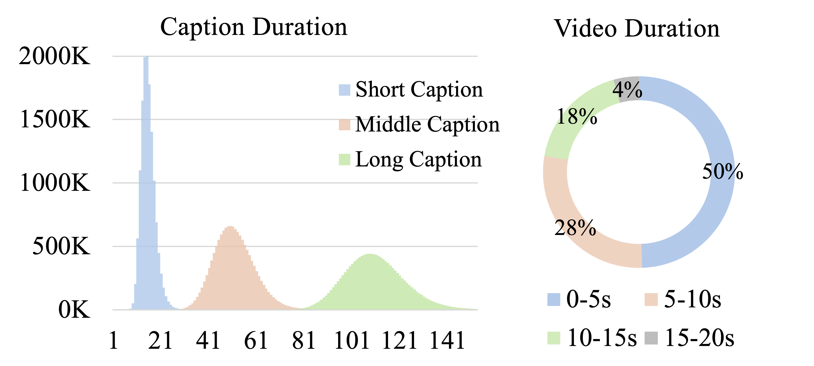
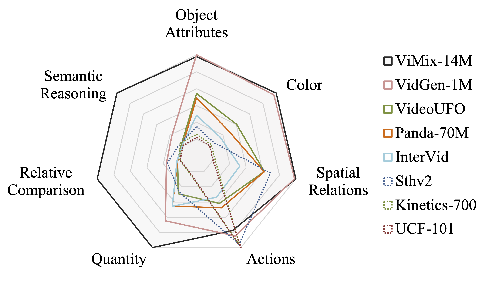

# ViMix-14M: A Curated Multi-Source Video-Text Dataset

Official PyTorch implementation of **"ViMix-14M: A Curated Multi-Source Video–Text Dataset with Long-Form, High-Quality Captions and Crawl-Free Access"**

**Authors:** Timing Yang, Feng Wang, Sucheng Ren, Alan Yuille 

Johns Hopkins University

[[Paper]](https://arxiv.org/abs/XXXX.XXXXX) [[Dataset]](https://huggingface.co/datasets/Timing1/ViMix-14M)

---

## Overview

Text-to-video generation has surged in interest since Sora, yet open-source models still face a data bottleneck: there is no large, high-quality, easily obtainable video–text corpus. Existing public datasets typically require manual YouTube crawling, which yields low usable volume due to link rot and access limits, and raises licensing uncertainty. This work addresses this challenge by introducing ViMix-14M, a curated multi-source video–text dataset of around 14 million pairs that provides crawl-free, download-ready access and long-form, high-quality captions tightly aligned to video. ViMix-14M is built by merging diverse open video sources, followed by unified de-duplication and quality filtering, and a multi-granularity, ground-truth-guided re-captioning pipeline that refines descriptions to better match actions, scenes, and temporal structure. We evaluate the dataset by multimodal retrieval, text-to-video generation, and video question answering tasks, observing consistent improvements over counterpart datasets. We hope this work can help removing the key barrier to training and fine-tuning open-source video foundation models, and provide insights of building high-quality and generalizable video-text datasets.

<p align="center">
  
  <br>
  <em>Qualitative comparison of video captions. In contrast to existing datasets (e.g., InternVid) that use brief and generic descriptions, our ViMix-14M contains rich visual details including precise spatial relationships, object attributes, action states, and motion details, demonstrating superior scene understanding capabilities.</em>
</p>

---

## Dataset Statistics & Caption Quality

### Composition by Source

<div align="center">

| Dataset | #Videos | Total Hrs | Avg Len(s) | Short | Middle | Long |
|:--------|:-------:|:---------:|:----------:|:-----:|:------:|:----:|
| InternVid | 10.6M | 16.3K | 5.5 | 14.4 | 50.5 | 109.2 |
| VideoUFO | 1.09M | 2.12K | 7.0 | 15.9 | 53.2 | 113.4 |
| VidGen-1M | 1.00M | 2.26K | 8.1 | 13.7 | 47.2 | 110.1 |
| Kinetics-700 | 0.63M | 1.58K | 9.0 | 13.6 | 52.2 | 111.4 |
| Something-Something V2 | 0.22M | 234 | 3.8 | 13.9 | 46.1 | 107.8 |
| OpenVideo | 0.11M | 331 | 11.2 | 17.8 | 57.4 | 117.8 |
| UCF-101 | 0.01M | 26.6 | 7.2 | 13.4 | 50.3 | 109.3 |
| **ViMix-14M** | **13.7M** | **22.8K** | **6.0** | **14.4** | **50.6** | **109.8** |

*Caption Length in words: Short (~14 words), Middle (~51 words), Long (~110 words)*

</div>

### Visual Statistics

<table align="center">
  <tr>
    <td align="center">
      
      <br>
      <em><strong>Left:</strong> Distribution of caption lengths across three granularities. <strong>Right:</strong> Video duration distribution showing 50% videos are 0-5s, 28% are 5-10s.</em>
    </td>
    <td align="center">
      
      <br>
      <em>Multi-dimensional caption quality comparison across datasets. Our captions achieve superior coverage in all semantic dimensions.</em>
    </td>
  </tr>
</table>

Our captions demonstrate superior semantic richness across multiple dimensions: **Object Attributes**, **Color**, **Spatial Relations**, **Quantity**, **Actions**, **Relative Comparison**, and **Semantic Reasoning**.

---

## Video Generation Quality

<p align="center">
  
  <br>
  <em>Video generation quality comparison across caption granularities. Origin captions provide basic scenes; Short captions add primary actions; Middle captions incorporate visual details like colors and spatial relationships; Long captions achieve the best results through fine-grained attributes and contextual reasoning. Quality hierarchy: <strong>Origin < Short < Middle < Long</strong>.</em>
</p>

Caption granularity progressively improves video generation quality from **Origin → Short → Middle → Long**.

---

## Video Question Answering

<p align="center">
  
  <br>
  <em>Caption evaluation via video question-answering tasks. Comparison between baseline captions and ours across multiple datasets. Color markers (✓) show answer coverage. Our captions capture richer visual details, leading to more accurate responses for attribute-specific and content-focused questions.</em>
</p>

Our captions enable accurate answers to diverse question types including **object identification**, **attribute recognition**, **spatial localization**, and **scene understanding**.

---

## Citation
```bibtex
@article{yang2025vimix,
  title={ViMix-14M: A Curated Multi-Source Video-Text Dataset with Long-Form, High-Quality Captions and Crawl-Free Access},
  author={Yang, Timing and Wang, Feng and Ren, Sucheng and Yuille, Alan},
  journal={arXiv preprint arXiv:XXXX.XXXXX},
  year={2025}
}
```

## License

Apache 2.0 License
